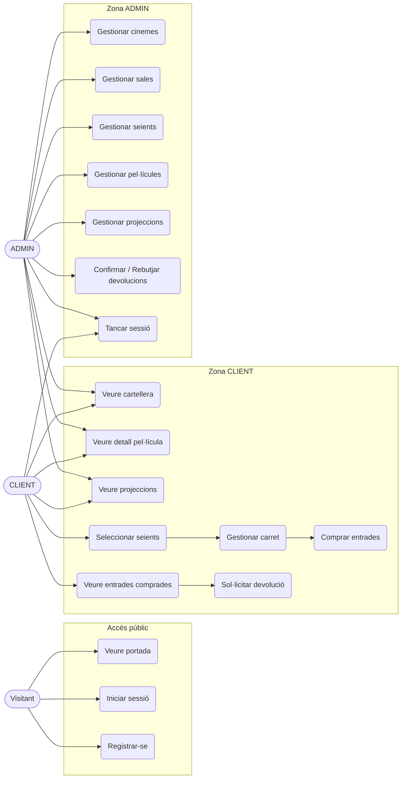
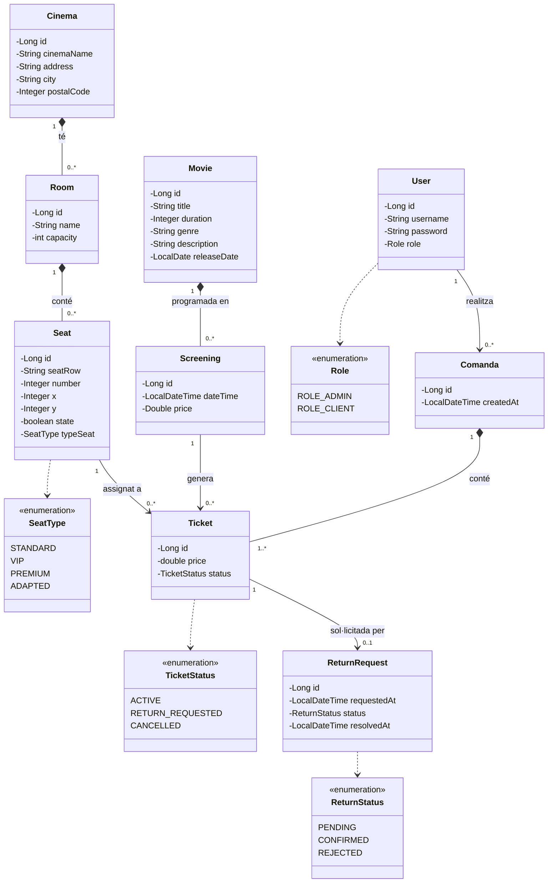

## Diagrama de Casos d'Ús

```mermaid
flowchart LR
    VISITANT(["Visitant"])
    CLIENT(["CLIENT"])
    ADMIN(["ADMIN"])

    subgraph pub ["Accés públic"]
        UC1("Veure portada")
        UC2("Iniciar sessió")
        UC3("Registrar-se")
    end

    subgraph cli ["Zona CLIENT"]
        UC4("Veure cartellera")
        UC5("Veure detall pel·lícula")
        UC6("Veure projeccions")
        UC7("Seleccionar seients")
        UC8("Gestionar carret")
        UC9("Comprar entrades")
        UC10("Veure entrades comprades")
        UC11("Sol·licitar devolució")
    end

    subgraph adm ["Zona ADMIN"]
        UC12("Gestionar cinemes")
        UC13("Gestionar sales")
        UC14("Gestionar seients")
        UC15("Gestionar pel·lícules")
        UC16("Gestionar projeccions")
        UC17("Confirmar / Rebutjar devolucions")
        UC18("Tancar sessió")
    end

    VISITANT --> UC1 & UC2 & UC3

    CLIENT --> UC4 & UC5 & UC6
    CLIENT --> UC7 --> UC8 --> UC9
    CLIENT --> UC10 --> UC11
    CLIENT --> UC18

    ADMIN --> UC4 & UC5 & UC6
    ADMIN --> UC12 & UC13 & UC14 & UC15 & UC16
    ADMIN --> UC17
    ADMIN --> UC18
```

---

## Diagrama de Classes UML

```mermaid
classDiagram
    direction TB

    class Cinema {
        -Long id
        -String cinemaName
        -String address
        -String city
        -Integer postalCode
    }
    class Room {
        -Long id
        -String name
        -int capacity
    }
    class Seat {
        -Long id
        -String seatRow
        -Integer number
        -Integer x
        -Integer y
        -boolean state
        -SeatType typeSeat
    }
    class SeatType {
        <<enumeration>>
        STANDARD
        VIP
        PREMIUM
        ADAPTED
    }
    class Movie {
        -Long id
        -String title
        -Integer duration
        -String genre
        -String description
        -LocalDate releaseDate
    }
    class Screening {
        -Long id
        -LocalDateTime dateTime
        -Double price
    }
    class Comanda {
        -Long id
        -LocalDateTime createdAt
    }
    class Ticket {
        -Long id
        -double price
        -TicketStatus status
    }
    class TicketStatus {
        <<enumeration>>
        ACTIVE
        RETURN_REQUESTED
        CANCELLED
    }
    class User {
        -Long id
        -String username
        -String password
        -Role role
    }
    class Role {
        <<enumeration>>
        ROLE_ADMIN
        ROLE_CLIENT
    }
    class ReturnRequest {
        -Long id
        -LocalDateTime requestedAt
        -ReturnStatus status
        -LocalDateTime resolvedAt
    }
    class ReturnStatus {
        <<enumeration>>
        PENDING
        CONFIRMED
        REJECTED
    }

    Cinema "1" *-- "0..*" Room : té
    Room "1" *-- "0..*" Seat : conté
    Movie "1" *-- "0..*" Screening : programada en
    Screening "1" --> "0..*" Ticket : genera
    Seat "1" --> "0..*" Ticket : assignat a
    Comanda "1" *-- "1..*" Ticket : conté
    User "1" --> "0..*" Comanda : realitza
    Ticket "1" --> "0..1" ReturnRequest : sol·licitada per
    Seat ..> SeatType
    Ticket ..> TicketStatus
    User ..> Role
    ReturnRequest ..> ReturnStatus
```

---
