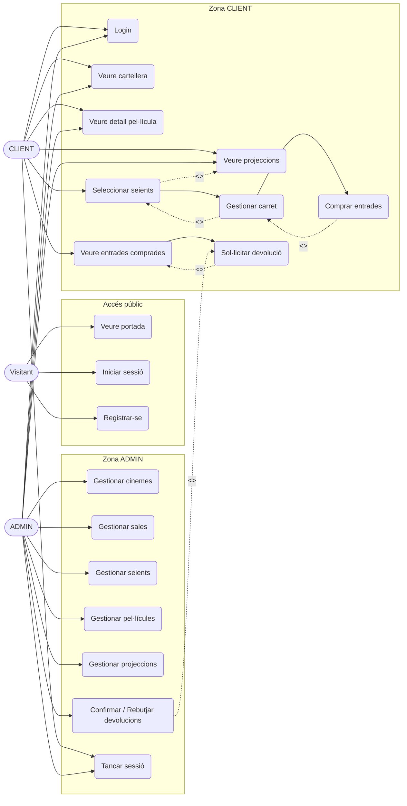
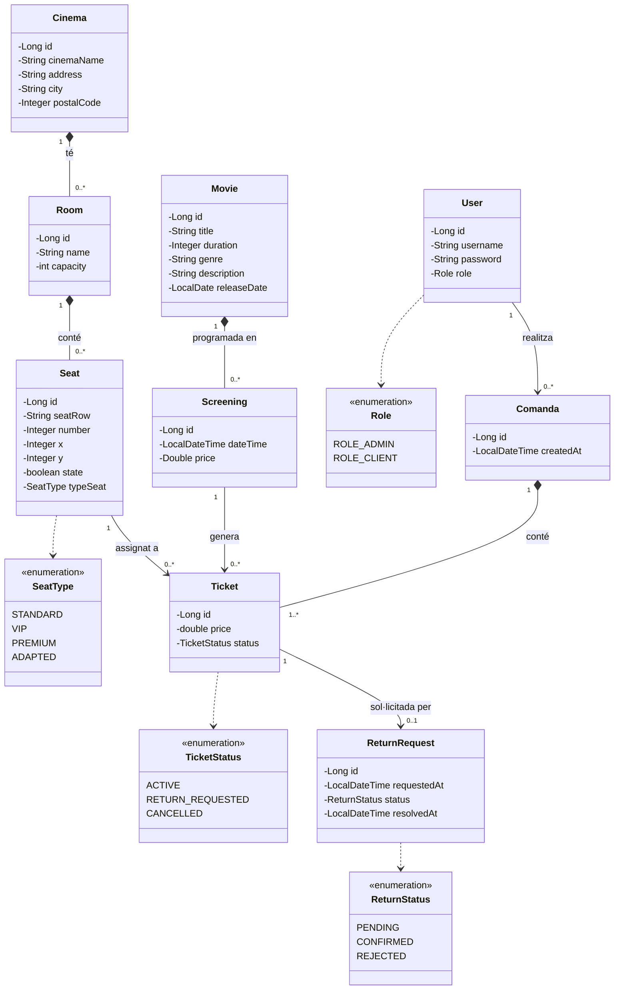

**Usuaris de prova**

| Usuari | Contrasenya | Rol |
|--------|-------------|-----|
| `admin` | `admin` | ADMIN |
| `client` | `client` | CLIENT |

---

## Funcionalitat extra (reserves, carret i devolucions)

La funcionalitat extra implementada és el flux complet de compra d'entrades:

1. Selecció de seients en una projecció (`/screenings/reserve/{id}`).
2. Gestió de carret en sessió HTTP (`/cart`).
3. Checkout amb control de concurrència (`/cart/checkout`) i restricció única per seient+projecció.
4. Generació de comanda i tickets persistits a base de dades.
5. Historial d'entrades del client (`/tickets`).
6. Devolucions amb aprovació d'admin (`/admin/returns`).

Cancel·lació de reserva (via devolució):

- Client: `POST /tickets/{id}/return` crea `ReturnRequest` pendent.
- Admin confirma: ticket `CANCELLED` i seient alliberat (`seat.state = true`).
- Admin rebutja: ticket torna a `ACTIVE` i el seient es manté ocupat.

---

## Requisits d'avaluació coberts

| Requisit | Evidència resumida |
|---|---|
| Actors definits | Rols `ADMIN` i `CLIENT` amb permisos separats a Spring Security |
| Casos d'ús clau | Login, gestió CRUD, reserva, compra, devolució |
| Domini principal | `Cinema`, `Room`, `Seat`, `Movie`, `Screening`, `Comanda` (Order), `Ticket` |
| Relacions UML | Cardinalitats 1-N i N-1 representades al diagrama de classes |
| Coherència amb implementació | Entitats, repositoris i controladors alineats amb els diagrames |
| Flux extra multi-pas | Reserva → carret → compra → historial → devolució/aprovació |

---

## Fitxers de diagrames lliurats

- [docs/casos-us.puml](docs/casos-us.puml)
- [docs/classes.puml](docs/classes.puml)
- [docs/DIAGRAMES.md](docs/DIAGRAMES.md)

---

## Diagrama de Casos d'Ús

---

## Diagrama de Classes UML

