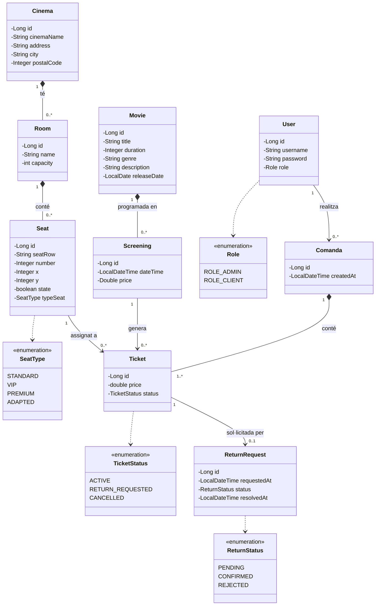

# CinemaDaw

Aplicació web de gestió d'una cadena de cinemes construïda amb Spring Boot. Implementa autenticació per rols, CRUD complet de tot el domini, selecció de seients interactiva mitjançant SVG, carret de compra en sessió, gestió de devolucions amb flux d'aprovació, sistema de notícies i validació de formularis a tots els formularis.

## Tecnologies

- Java 17 + Spring Boot 4.0.2
- Spring Security (autenticació + autorització per rols)
- Spring Data JPA + Hibernate + H2 (en memòria)
- Thymeleaf + Bean Validation (Jakarta)
- Maven

## Com executar

```bash
./mvnw spring-boot:run
```

- App: http://localhost:8080
- Consola H2: http://localhost:8080/h2-console (JDBC: `jdbc:h2:mem:cinemadb`, user: `sa`)

**Usuaris de prova** (es creen automàticament a l'inici):

| Usuari | Contrasenya | Rol |
|--------|-------------|-----|
| `admin` | `admin` | ADMIN |
| `client` | `client` | CLIENT |

---

## Funcionalitats implementades

### 1. Autenticació i registre d'usuaris

- Login amb Spring Security i pàgina personalitzada a `/login`.
- Registre de nous clients a `/register` amb codificació de contrasenya (BCrypt).
- Redirecció post-login diferent per rol: ADMIN → `/admin`, CLIENT → `/client` (via `CustomLoginSuccessHandler`).
- Protecció de totes les rutes per rol mitjançant `SecurityConfig`.

### 2. Control d'accés per rols (ADMIN / CLIENT)

Dos rols completament diferenciats:

**ADMIN** té accés a:
- CRUD de cinemes, sales, seients, pel·lícules i projeccions.
- Gestió de devolucions (aprovació/rebuig).
- Publicació de notícies.

**CLIENT** té accés a:
- Cartellera pública i detall de pel·lícules.
- Selecció de seients i compra d'entrades.
- Historial de comandes i sol·licitud de devolucions.

La navegació del layout mostra o amaga opcions de menú dinàmicament segons el rol (via `SecurityModelAttributes` injectat a totes les vistes amb `@ControllerAdvice`).

### 3. CRUD complet de tot el domini

Totes les entitats tenen creació, edició, llistat i eliminació amb gestió d'errors i missatges flash:

| Entitat | Rutes principals |
|---------|-----------------|
| Cinema | `/cinemes`, `/cinema/create`, `/cinema/edit/{id}`, `/cinema/delete/{id}` |
| Room | `/room/create`, `/room/{id}/update`, `/room/{id}/delete` |
| Seat | `/seats/create/{roomId}`, `/seats/{id}`, `/seats/update/{id}`, `/seats/delete/{id}` |
| Movie | `/movies/movies`, `/movies/create`, `/movies/update/{id}`, `/movies/delete/{id}` |
| Screening | `/screenings/new`, `/screenings/edit/{id}`, `/screenings/delete/{id}` |

### 4. Selecció de seients interactiva (SVG dinàmic)

A `/screenings/reserve/{id}` es renderitza un mapa visual de la sala directament en SVG generat des del servidor (Thymeleaf):

- Cada seient es dibuixa en la seva posició real (coordenades X/Y emmagatzemades a la BD).
- **Verd**: seient disponible (clicable).
- **Gris**: seient ocupat (no seleccionable).
- **Vermell**: seient seleccionat per l'usuari actual.
- Es mostra una "PANTALLA" visual a la part superior del mapa.
- Llegenda de colors inclosa.
- Si l'usuari ja té seients al carret per la mateixa projecció, es mostren pre-seleccionats.

### 5. Carret de compra en sessió HTTP

El carret s'emmagatzema a la `HttpSession` com a `SeatsListDTO`:

- `POST /screenings/reserve` → afegeix seients seleccionats al carret.
- `GET /cart` → mostra resum de seients, projecció i preu total.
- `POST /cart/remove` → elimina un seient individual del carret.
- Si es seleccionen seients d'una projecció diferent, el carret anterior es neteja automàticament.
- El preu total es calcula com: `nombre de seients × preu de la projecció`.

### 6. Procés de compra (checkout) amb gestió de concurrència

`POST /cart/checkout` executa:

1. Verifica disponibilitat de cada seient en el moment de la compra.
2. Crea una `Comanda` amb timestamp.
3. Crea un `Ticket` per cada seient vinculat a la `Comanda`.
4. Marca cada seient com a no disponible (`seat.state = false`).
5. Buida el carret de la sessió.
6. Captura `DataIntegrityViolationException` per evitar doble reserva concurrent (constraint UNIQUE sobre `(seat_id, screening_id)`), informant l'usuari dels seients conflictius.

### 7. Historial de comandes i entrades

A `/tickets` el client veu totes les seves entrades agrupades per comanda (ordre invers, la més recent primer):

- ID de comanda, data de compra, nombre d'entrades.
- Detall de cada entrada: pel·lícula, sala, fila/número, preu, estat.
- Botó de "Sol·licitar devolució" visible si el tiquet està `ACTIVE`.

### 8. Sistema de devolucions i cancel·lació de reserves (flux d'aprovació)

Aquest projecte tracta la "cancel·lació de reserva" com una **devolució d'una entrada ja comprada**.

Flux d'estats del **Ticket**: `ACTIVE` → `RETURN_REQUESTED` → `CANCELLED` (si s'aprova) / `ACTIVE` (si es rebutja)

Flux d'estats de **ReturnRequest**: `PENDING` → `CONFIRMED` / `REJECTED`

Procés complet:

1. El client compra una entrada i la veu a `/tickets` amb estat `ACTIVE`.
2. El client envia `POST /tickets/{id}/return` per demanar la devolució.
3. El backend valida:
    - Que el ticket existeix.
    - Que està en estat `ACTIVE`.
    - Que no hi ha una altra sol·licitud `PENDING` per al mateix ticket.
4. Si tot és correcte, es crea `ReturnRequest` (`requestedAt = now`, `status = PENDING`) i el ticket passa a `RETURN_REQUESTED`.
5. L'admin revisa les pendents a `GET /admin/returns`.
6. Si l'admin confirma (`POST /admin/returns/{id}/confirm`):
    - `ReturnRequest` passa a `CONFIRMED` i es guarda `resolvedAt`.
    - El ticket passa a `CANCELLED`.
    - El seient es torna a alliberar (`seat.state = true`).
7. Si l'admin rebutja (`POST /admin/returns/{id}/reject`):
    - `ReturnRequest` passa a `REJECTED` i es guarda `resolvedAt`.
    - El ticket torna a `ACTIVE`.
    - El seient es manté ocupat.

Notes tècniques importants:

- El seient **només** torna a estar disponible quan l'admin confirma la devolució.
- Al checkout, si existeix un ticket `CANCELLED` pel mateix parell `(seat, screening)`, es reutilitza per evitar trencar la restricció `UNIQUE(seat_id, screening_id)`.
- Aquest disseny evita dobles compres concurrents i manté traçabilitat completa (`requestedAt`, `resolvedAt`, estat del ticket i de la sol·licitud).

### 9. Sistema de notícies (persistència en fitxer)

- L'admin publica notícies (titular + cos) des de `/admin/news`.
- Les notícies es persisteixen al fitxer `news.txt` (format `titular:cos`, una per línia).
- `NewService` gestiona lectura i escriptura amb codificació UTF-8.
- La pàgina pública `/home` mostra totes les notícies publicades a tots els usuaris i visitants.

### 10. Validació de formularis a servidor

Tots els formularis utilitzen anotacions Jakarta Validation amb feedback d'errors a la vista:

| Entitat | Camps validats |
|---------|---------------|
| Cinema | nom (2-100), adreça (5-200), ciutat (2-100), codi postal (10000-99999) |
| Room | nom (2-100), capacitat (1-9999) |
| Seat | fila (1-5 chars), número (1-999), X (0-79), Y (0-59), tipus |
| Movie | títol, durada, gènere, descripció (10-1000), data estrena |
| Screening | data/hora, preu (0.50-100.00) |

### 11. Inicialització automàtica de dades

`Proves.java` (CommandLineRunner) crea en cada arrencada:

- 2 cinemes: "Ocine" i "Cinema 3D" a Tarragona.
- 3 sales per cinema amb capacitats de 100 i 50 seients.
- Seients generats automàticament en graella (files A-Z, columnes 1-10, coordenades calculades per al SVG).
- Els 2 usuaris de prova (admin/admin, client/client) amb contrasenyes codificades.

---

## Estructura del projecte

```
src/main/java/com/daw/cinemadaw/
├── config/
│   ├── SecurityConfig.java            # Regles d'autorització per rols
│   ├── CustomLoginSuccessHandler.java # Redirecció post-login per rol
│   ├── SecurityModelAttributes.java   # Injecta flags de rol a totes les vistes
│   ├── GlobalExceptionHandler.java    # Gestió global d'errors
│   └── Proves.java                    # Inicialització de dades (CommandLineRunner)
├── controller/
│   ├── HomeController.java            # Inici, login, registre, notícies
│   ├── CinemaController.java          # CRUD cinemes
│   ├── RoomController.java            # CRUD sales
│   ├── SeatController.java            # CRUD seients
│   ├── MovieController.java           # CRUD pel·lícules
│   ├── ScreeningController.java       # CRUD projeccions + selecció SVG
│   ├── CartController.java            # Carret + checkout
│   └── TicketController.java          # Entrades + devolucions
├── domain/cinema/
│   ├── Cinema, Room, Seat, Movie, Screening
│   ├── Comanda, Ticket, User, ReturnRequest
│   └── Enums: Role, SeatType, TicketStatus, ReturnStatus
├── repository/                        # 9 interfícies JPA amb queries personalitzades
├── service/
│   ├── UserDetailService.java         # Spring Security UserDetailsService
│   ├── TicketService.java             # Lògica de compra i agrupació per comanda
│   └── NewService.java                # Lectura/escriptura de notícies en fitxer
└── dto/
    └── SeatsListDTO.java              # Carret en sessió (screeningId + llista seatIds)
```

---

## Diagrama de Casos d'Ús


---

## Diagrama de Classes UML


