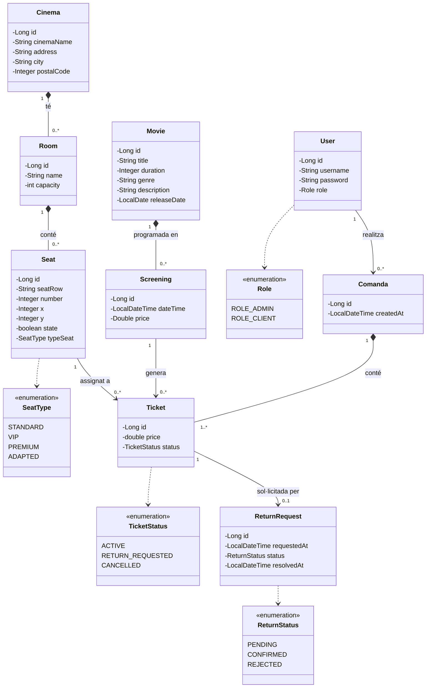

# Diagrames UML — CinemaDaw

## 1. Diagrama de Casos d'Ús

```plantuml
Vegeu casos-us.puml
```

**Actors:**
- **Visitant** — usuari no autenticat
- **CLIENT** — usuari registrat amb rol CLIENT
- **ADMIN** — usuari amb rol ADMIN

**Casos d'ús principals:**

| Actor | Cas d'ús |
|-------|----------|
| Visitant | Veure portada, Iniciar sessió, Registrar-se |
| CLIENT | Veure cartellera, Veure projeccions, Seleccionar seients, Comprar entrades, Veure entrades, Sol·licitar devolució, Tancar sessió |
| ADMIN | Gestionar cinemes/sales/seients/pel·lícules/projeccions, Gestionar devolucions, Veure cartellera, Tancar sessió |

**Relacions:**
- `Seleccionar seients` <<include>> `Veure projeccions`
- `Gestionar carret` <<include>> `Seleccionar seients`
- `Comprar entrades` <<include>> `Gestionar carret`
- `Sol·licitar devolució` <<include>> `Veure entrades`
- `Gestionar devolucions` <<extend>> `Sol·licitar devolució`

---

## 2. Diagrama de Classes UML



---

## Fitxers PlantUML

Per renderitzar els diagrames `.puml` amb totes les classes i relacions:
- Instal·la l'extensió **PlantUML** a VS Code
- O utilitza [plantuml.com/plantuml](https://www.plantuml.com/plantuml/uml/)
- Fitxers: `docs/casos-us.puml` i `docs/classes.puml`
